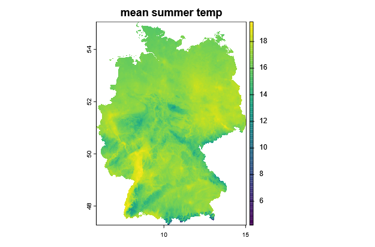

A solid data basis is the foundation for any biodiversity model.
The following text will give a short intorduction on what type of data is commonly used in biodiversity models (including metaRange) and where to find, download and how to process it.

## Environmental data

It may be obvious, but it is important to restate and keep in mind that different species have different requirement for their habitat.
So just using a standardized data set of environmental variables to model different species may not be the approach that yields the best results.

Similar to the question of which ecological mechanisms are needed to describe the population dynamics of a species, one should equally research the question of the true ecological niche of a species and what environmental variables best capture this niche.

There are many sources for environmental data (including predictions for the future).
The "best" data source depends on the study region, the required spatial and temporal resolution as well as the avilability of different variables in the dataset. 

To focus on the basics, in the following example we will gather data for the insect *Mantis religiosa* (European mantis) in Germany.

This species prefers warm temperatures and lives on rich structured grasslands and the border between grasslands and forests, so we will focus on the environmental variables of % grassland and summer temperature.

First we need to load the required packages and set up the default path and folder structure:

``` r
library(rgbif)              # access to GBIF species occurrence data
library(geodata)            # access to global environmental datasets
library(terra)              # raster processing
library(sf)                 # vector data processing
library(tidyverse)          # general data manipulation
library(CoordinateCleaner)  # leaning occurrence coordinates
library(ggplot2)            # plotting
library(here)               # relative paths in project

tutorial_folder_name <- "download_env_data"
dir.create(file.path(here(), tutorial_folder_name))
dir.create(file.path(here(), tutorial_folder_name, "raw_data"))
dir.create(file.path(here(), tutorial_folder_name, "processed_data"))
geodata_path(here(tutorial_folder_name, "raw_data"))

```

We can download the outline of of Germany to exctract the exact geographic coordinates we are interrested in.
For this (and the other environmental data), we will use the `geodata` package that offers access to a variety of global environmental datasets.

``` r
DE <- gadm(country = "DEU", level = 0, path = geodata_path())
plot(DE)
DE_extent <- ext(DE)
DE_extent
#> SpatExtent : 5.866, 15.041, 47.270, 55.056 (xmin, xmax, ymin, ymax)
```


Now we can download the grassland landcover data for Germany.

``` r
DE_grassland <- landcover(var = "grassland", path = geodata_path())
DE_grassland <- crop(DE_grassland, DE_extent)
DE_grassland <- mask(DE_grassland, DE)
plot(DE_grassland, main = "% grassland")
```


And the climate data (BIO10 = Mean Temperature of Warmest Quarter).

``` r
DE_temp <- worldclim_country(country = "DEU", var = "bio", res = 2.5, path = geodata_path())
DE_temp <- DE_temp[["wc2.1_30s_bio_10"]]
DE_temp <- crop(DE_temp, DE_extent)
DE_temp <- mask(DE_temp, DE)
plot(DE_temp, main = "mean summer temp")
```


## Species occurence data

For the occurence data of the species, we are goingin to download data from the Global Biodiversity Information Facility (GBIF).
GBIF offers the R package `rgbif` that lets you search and download occurence data directly from R.
There are plenty of options to construct this search query, including some to get citable DOIs for the data you download.
Here, we will keep it simple and just search for occurences in Germany that have coordinates and limit the number of results to 1000.
``` r
# query and download data
occ_data <- occ_search(
    scientificName = "Mantis religiosa",
    country = "DE",
    hasCoordinate = TRUE,
    limit = 1000
)
# clean coordinates (remove common errors)
occ_data_clean <- clean_coordinates(
    x = occ_data$data,
    lon = "decimalLongitude",
    lat = "decimalLatitude",
    species = "species",
    tests = c("centroids", "equal", "gbif", "institutions", "zeros")
)
# convert to spatial vector
occurence <- vect(data.frame(
    lon = occ_data_clean$decimalLongitude,
    lat = occ_data_clean$decimalLatitude
), crs = "EPSG:4326")
# exclude points outside Germany
occurence <- crop(occurence, DE_extent)
plot(occurence)
plot(DE, add = TRUE)
```


Finally, we can save the processed data to the project folder for later use.
``` r
writeVector(
    occurence,
    here(tutorial_folder_name, "processed_data", "Mantis_religiosa_occurrence.shp"),
    overwrite=TRUE)
writeRaster(
    DE_grassland, here(tutorial_folder_name,
    "processed_data", "DE_grassland.tif"),
    overwrite=TRUE)
writeRaster(
    DE_temp,
    here(tutorial_folder_name, "processed_data", "DE_bio10.tif"),
    overwrite=TRUE)
```


## Niche estimation example

To estimate the species niche based on the gathered data, we can now extract the environmental values at the occurence points and use that data "fit" a normal distribution that can represent the species niche.

``` r
temp_extr <- terra::extract(DE_temp, occurence)
names(temp_extr)<- c("ID","temperature")
temp_extr <- temp_extr[!is.na(temp_extr$temperature), ]
```

Estimate the niche based on these values
``` r
temp_density <- density(temp_extr$temperature, bw = 2)
temp_max_density <- temp_density$x[which.max(temp_density$y)]
temp_min <- quantile(temp_extr$temperature, probs = 0.0025)
temp_max <- quantile(temp_extr$temperature, probs = 0.9975)

```

Combine the data and plot it

``` r
temp_combined <- temp_extr
temp_combined$type <- "extracted"
temp_normal <- rnorm(10000, temp_max_density, sd = abs((temp_min - temp_max)) / (6))
temp_normal <- data.frame("temperature" = temp_normal, "ID"= NA, "type" = "estimated")
temp_combined <- rbind(temp_combined, temp_normal)

temp_plot <- 
  ggplot(temp_combined, aes(x=temperature, after_stat(scaled), fill=type)) +
    geom_density(color="#e9ecef", alpha=0.8) +
    ylab("scaled frequency") +
    scale_fill_manual(values=c("darkorange3", "darkred")) +
    theme_dark()
temp_plot
```


As you can see, the estimated niche (orange) fits quite well to the extracted data (red).

**Warning:** Before using this niche in a model, one should evaluate if the estimated niche makes ecologial sense and compare it to literature values.
It may include biases based on the occurence data used.