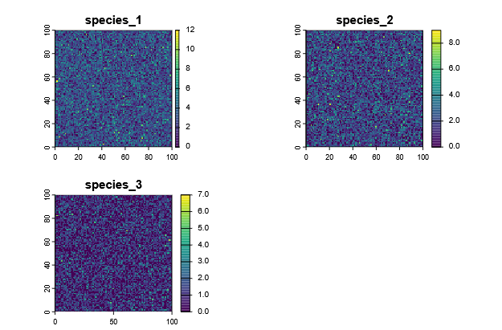
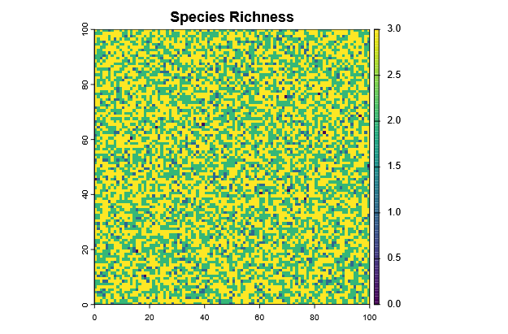
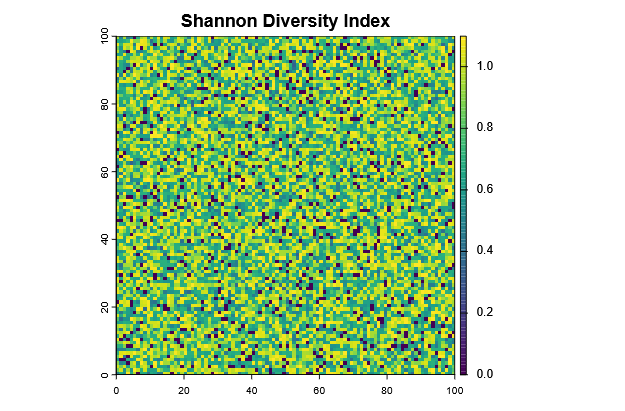
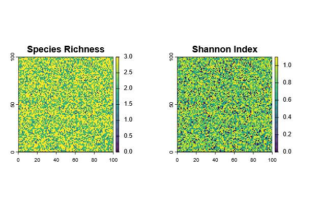
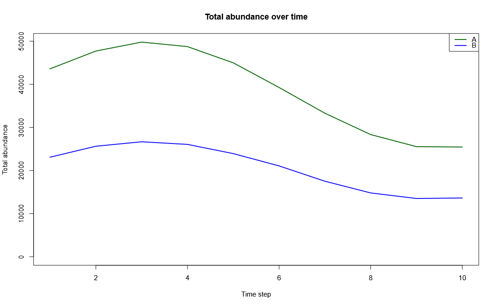
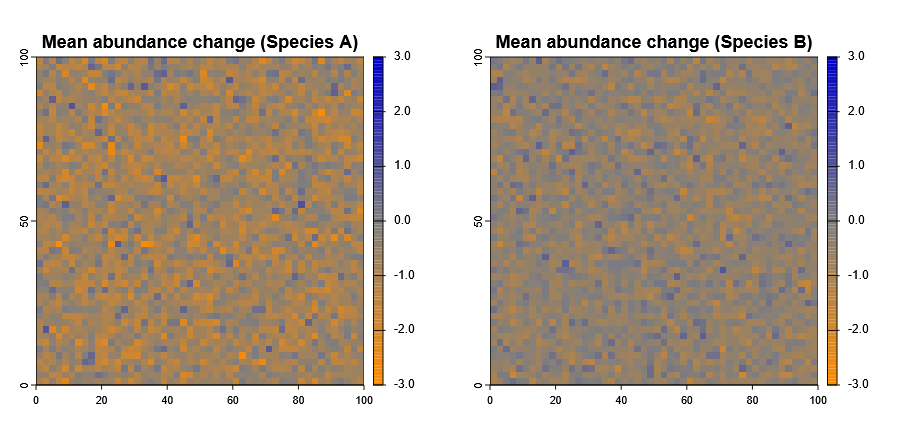

Depending on the study question, there are different ways to analyze the output of a metaRange simulation.
Here we will illustrate a few common biodiversity metrics that can be calculated from species abundance maps, such as species richness and the Shannon diversity index.

``` r
# Install and load required package
library(terra)
library(here)

```

1. Create Example Data

First wee need to creat some example data.
For this we create three 100 x 100 rasters representing abundances for three species.
``` r
# Create empty raster template
r_template <- rast(nrows=100, ncols=100, xmin=0, xmax=100, ymin=0, ymax=100)

# Simulate abundances for 3 species by drawing from a Poisson distribution
# and assigning to raster cells
set.seed(123)
sp1 <- rast(r_template)
values(sp1) <- rpois(ncell(sp1), lambda = 3)

sp2 <- rast(r_template)
values(sp2) <- rpois(ncell(sp2), lambda = 2)

sp3 <- rast(r_template)
values(sp3) <- rpois(ncell(sp3), lambda = 1)

# Combine into a single SpatRaster wirth different layers per species
abundance <- c(sp1, sp2, sp3)
names(abundance) <- c("species_1", "species_2", "species_3")

# Visualize
plot(abundance, type = "continuous")


```


From this data, we can now calculate different biodiversity metrics.

2. Species Richness

Species richness is defined as the numebr of species in each grid cell (i.e. with abundance > 0).
Therefore, it is very easy to calculate from the abundance rasters:
``` r
# Calculate richness per cell
richness <- sum(abundance > 0)
plot(richness, main = "Species Richness", type = "continuous")


```


3. Shannon Diversity Index

The Shannon index (H') uses not only the richness, but also the relative abundance (evenness) of each species to calculate diversity.
It has no direct "unit", as the species richness itself does, but is rather a measure of uncertainty for the question: "If I randomly pick an individual from this site, how (un)certain am I about which species it belongs to?".

​<math xmlns="http://www.w3.org/1998/Math/MathML" display="block">
  <mrow>
    <mi>H</mi><mo>'</mo><mo>=</mo>
    <mrow>
      <mo>-</mo>
      <munderover>
        <mo>&#x2211;</mo>
        <mrow><mi>i</mi><mo>=</mo><mn>1</mn></mrow>
        <mi>S</mi>
      </munderover>
      <msub><mi>p</mi><mi>i</mi></msub>
      <mo>&#x22C5;</mo>
      <mi>ln</mi>
      <mo>(</mo>
        <msub><mi>p</mi><mi>i</mi></msub>
      <mo>)</mo>
    </mrow>
  </mrow>
</math>

- `pi`   is the proportion (relative abundance) of species i at a site
- `S` is the total number of species considered

The code to calculate the Shannon index per cell is as also straightforward:
``` r
# Function to calculate Shannon index per cell
shannon <- function(x) {
  x <- x[x > 0]
  p <- x / sum(x)
  -sum(p * log(p))
}

# Apply across all cells
shannon_index <- app(abundance, shannon)
plot(shannon_index, main = "Shannon Diversity Index")

```


Now we can compare how richness and Shannon index differ across the landscape:
``` r
par(mfrow=c(1,2))
plot(richness, main="Species Richness")
plot(shannon_index, main="Shannon Index")


```



_________________________________

4. Time series Analysis of Biodiversity Metrics

We can not only calculate biodiversity metrics for a single time step, but also across a time series.

We can illustrate this with an example where we have abundance maps for two species across 10 time steps (e.g. years).
For this, we create `.tif` files, that represent a species abundance map at one year.
``` r
tutorial_folder_name <- "analyze_biodiv_data"
dir.create(file.path(here(), tutorial_folder_name))
dir.create(file.path(here(), tutorial_folder_name, "raw_data"))
raw_path <- file.path(here(), tutorial_folder_name, "raw_data")

# Create raster template
r_template <- rast(nrows=50, ncols=50, xmin=0, xmax=100, ymin=0, ymax=100)

set.seed(42)

# Function to generate abundance rasters for each time step
generate_species_time_series <- function(species_name, start_base_abundance) {
  for (t in 1:10) {
    # copy raster template
    r <- rast(r_template)
    # random variation over time
    values(r) <- rpois(ncell(r), lambda = start_base_abundance + sin(t/2) * start_base_abundance/3)
    filename <- sprintf("%s-abundance_%02d.tif", species_name, t)
    # save the file
    writeRaster(r, file.path(raw_path, filename), overwrite = TRUE)
  }
}

# Generate time series for two species
generate_species_time_series("species_A", start_base_abundance = 15)
generate_species_time_series("species_B", start_base_abundance = 8)

```

Now, we can load the time series back into R

For this, `terra::sds()` can be used to group all .tif files for each species into one time-series object (i.e. a collection of 3D rasters).
``` r
# List files
species_A_files <- list.files(raw_path, pattern = "species_A.*tif$", full.names = TRUE)
species_B_files <- list.files(raw_path, pattern = "species_B.*tif$", full.names = TRUE)

# Create SpatDataSet objects (time series per species)
abundance_timeseries <- sds(
  list(
    species_A = rast(species_A_files),
    species_B = rast(species_B_files)
  )
)


abundance_timeseries


```


Now `abundance_timeseries$species_A` and `abundance_timeseries$species_B` are both SpatRaster with 10 layers (one per time step).


5. Plot Total Abundance Over Time

The most basic thing we can do with this is to plot how total abundance changes over time for each species.
``` r
# Calculate total abundance per species per time step
sum_A <- global(abundance_timeseries$species_A, "sum")$sum
sum_B <- global(abundance_timeseries$species_B, "sum")$sum

# Combine into data frame
time <- 1:10
abundance_df <- data.frame(time, species_A = sum_A, species_B = sum_B)

# Plot
plot(time, abundance_df$species_A, type = "l", lwd = 2, col = "darkgreen",
     ylim = range(abundance_df), ylab = "Total abundance", xlab = "Time step",
     main = "Total abundance over time")
lines(time, abundance_df$species_B, col = "blue", lwd = 2)
legend("topright", legend = c("Species A", "Species B"),
       col = c("darkgreen", "blue"), lwd = 2)

```


6. Identify Areas of Population Increase / Decrease

More interestingly, we can also identify areas where populations are increasing or decreasing over time.
To do this we need to calculate the mean lagged difference across time steps per cell.
Lukily, `terra` already has a built-in `diff()` function.

``` r
# Calculate mean lagged difference for each species (between each layer)
mean_diff_A <- diff(abundance_timeseries$species_A)
mean_diff_B <- diff(abundance_timeseries$species_B)

# now get the mean
mean_diff_A <- mean(mean_diff_A)
mean_diff_B <- mean(mean_diff_B)

# Plot
par(mfrow=c(1,2))

# custom color palette
plot_colors <- hcl.colors(20, palette = "Green-Brown", rev = TRUE)
pal <- colorRampPalette(c("darkorange", "grey50", "blue3"))
lim <- max(abs(global(mean_diff_A, range, na.rm=TRUE)))
lim <- max(lim, abs(global(mean_diff_B, range, na.rm=TRUE)))
breaks <- seq(-lim, lim, length.out = 20)

plot(mean_diff_A, main="Mean abundance change (Species A)", col=pal(100), breaks=breaks, type ="continuous")
plot(mean_diff_B, main="Mean abundance change (Species B)", col=pal(100), breaks=breaks, type ="continuous")
par(mfrow=c(1,1))
```


