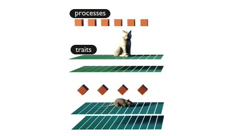
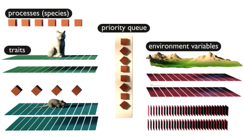

import { Card, CardGrid } from '@astrojs/starlight/components';


## Overview

<CardGrid>
  <Card title="Environment">
    The framework is grid based and each environmental variable is represented by a seperate raster layer.
    
  </Card>
  <Card title="Species">
    This environment is inhabited by one or multiple species, where each population is represented by one grid cell of the environment.
    
  </Card>
    <Card title="Mechanisms">
    Species are defined by traits (any type of biological meaningful data) and processes (mechanisms that define how the species interacts with its environment and other species).
    
  </Card>
  <Card title="Execution">
    The processes are sorted into a queue, based on a user given priority, and executed each time step.
    
  </Card>
</CardGrid>

## R package
You can install the R package from CRAN with:

```r
install.packages("metaRange")
```

Or view and install it from the [GitHub repository](https://github.com/metaRange/metaRange) for the latest development version.
```r
devtools::install_github("metaRange/metaRange")
```

## Publications

Fallert, S., Li, L., & Cabral, J. S. (2025). metaRange: A framework to build mechanistic range models. Methods in Ecology and Evolution, 16, 49–56. https://doi.org/10.1111/2041-210X.14461
