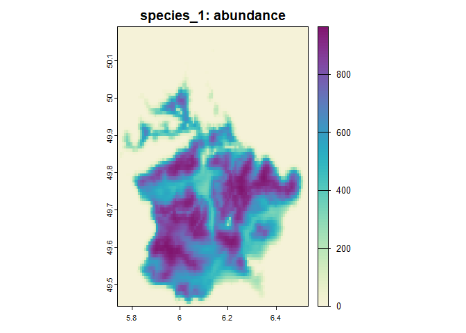
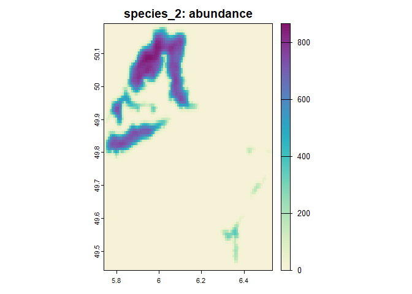
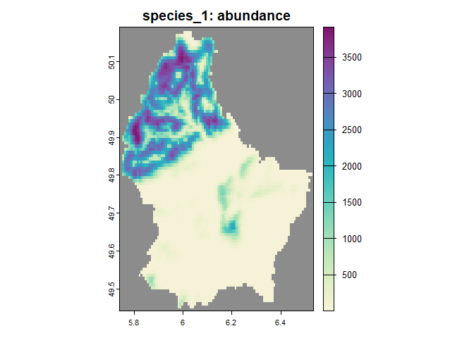
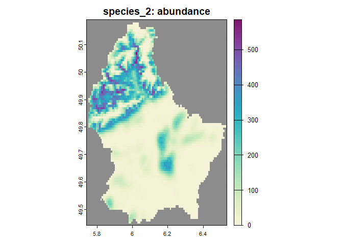

To further expand the example we have so far, we can introduce more
processes around the interaction between the two species.

First we will generate the same setup.

``` r
library(metaRange)
library(terra)
set_verbosity(0)

raster_file <- system.file("ex/elev.tif", package = "terra")
r <- rast(raster_file)
temperature <- scale(r, center = FALSE, scale = TRUE) * 10 + 273.15
precipitation <- r * 2
temperature <- rep(temperature, 10)
precipitation <- rep(precipitation, 10)
landscape <- sds(temperature, precipitation)
names(landscape) <- c("temperature", "precipitation")

sim <- create_simulation(landscape)
sim$add_species(name = "species_1")
sim$add_species(name = "species_2")

sim$add_traits(
    species = c("species_1", "species_2"),
    population_level = TRUE,
    abundance = 900,
    climate_suitability = 1,
    reproduction_rate = 0.3,
    carrying_capacity = 1000
)
sim$add_traits(
    species = c("species_1", "species_2"),
    population_level = FALSE,
    dispersal_kernel = calculate_dispersal_kernel(
        max_dispersal_dist = 3,
        kfun = negative_exponential_function,
        mean_dispersal_dist = 1
    )
)
```

## Competition

We are going to construct a simple model that simulates (asymmetric)
competition between two species. Both species will have the same value
for their optimal (i.e. their preferred) environmental niche values, but
species 2 will be able to tolerate a larger range compared to species 1.

``` r
opt_temp <- 283
min_temp_sp1 <- 279
max_temp_sp1 <- 287
min_temp_sp2 <- 260
max_temp_sp2 <- 300

opt_prec <- 700
min_prec_sp1 <- 350
max_prec_sp1 <- 850
min_prec_sp2 <- 0
max_prec_sp2 <- 1300

x <- seq(min_temp_sp2, max_temp_sp2, length.out = 100)
y_sp1 <- calculate_suitability(max_temp_sp1, opt_temp, min_temp_sp1, x)
y_sp2 <- calculate_suitability(max_temp_sp2, opt_temp, min_temp_sp2, x)
plot(x, y_sp1, type = "l", xlab = "Temperature [K]", ylab = "Suitability", col = "darkred", lwd = 2)
lines(x, y_sp2, col = "darkblue", lwd = 2)
legend(
    "topleft",
    legend = c("species 1", "species 2"),
    col = c("darkred", "darkblue"),
    lty = 1,
    lwd = 2,
    cex = 0.7
)
```


``` r
x <- seq(min_prec_sp2, max_prec_sp2, length.out = 100)
y_sp1 <- calculate_suitability(max_prec_sp1, opt_prec, min_prec_sp1, x)
y_sp2 <- calculate_suitability(max_prec_sp2, opt_prec, min_prec_sp2, x)
plot(x, y_sp1, type = "l", xlab = "precipitation [mm]", ylab = "Suitability", col = "darkred", lwd = 2)
lines(x, y_sp2, col = "darkblue", lwd = 2)
legend(
    "topleft",
    legend = c("species 1", "species 2"),
    col = c("darkred", "darkblue"),
    lty = 1,
    lwd = 2,
    cex = 0.7
)
```


Now we can add these values as traits to the species and also add the
processes introduced in the previous tutorials.

``` r
sim$add_traits(
    species = "species_1",
    population_level = FALSE,
    max_temperature = max_temp_sp1,
    optimal_temperature = opt_temp,
    min_temperature = min_temp_sp1,
    max_precipitation = max_prec_sp1,
    optimal_precipitation = opt_prec,
    min_precipitation = min_prec_sp1
)
sim$add_traits(
    species = "species_2",
    population_level = FALSE,
    max_temperature = max_temp_sp2,
    optimal_temperature = opt_temp,
    min_temperature = min_temp_sp2,
    max_precipitation = max_prec_sp2,
    optimal_precipitation = opt_prec,
    min_precipitation = min_prec_sp2
)
sim$add_process(
    species = c("species_1", "species_2"),
    process_name = "calculate_suitability",
    process_fun = function() {
        self$traits$climate_suitability <-
            calculate_suitability(
                self$traits$max_temperature,
                self$traits$optimal_temperature,
                self$traits$min_temperature,
                self$sim$environment$current$temperature
            ) *
            calculate_suitability(
                self$traits$max_precipitation,
                self$traits$optimal_precipitation,
                self$traits$min_precipitation,
                self$sim$environment$current$precipitation
            )
    },
    execution_priority = 1
)


sim$add_process(
    species = c("species_1", "species_2"),
    process_name = "reproduction",
    process_fun = function() {
        self$traits$abundance <-
            ricker_reproduction_model(
                self$traits$abundance,
                self$traits$reproduction_rate * self$traits$climate_suitability,
                self$traits$carrying_capacity * self$traits$climate_suitability
            )
    },
    execution_priority = 2
)
sim$add_process(
    species = c("species_1", "species_2"),
    process_name = "dispersal_process",
    process_fun = function() {
        self$traits[["abundance"]] <- dispersal(
            abundance = self$traits[["abundance"]],
            dispersal_kernel = self$traits[["dispersal_kernel"]]
        )
    },
    execution_priority = 3
)
```

The process that simulates competition between the two species will
reduce the carrying capacity of one species based on the abundance of
the other species. For simplicity, we will assume asymmetric
competition, in which species 1 is the superior competitor. This means
that if both species occur in one grid cell of the landscape:

-   The population size of species 1 is only dependent on the
    environmental conditions
-   The population size of species 2 is also dependent on the
    environmental conditions and aditionally reduced by the population
    size of species 1

``` r
sim$add_process(
    species = "species_2",
    process_name = "competition",
    process_fun = function() {
        self$traits$carrying_capacity <-
            pmax(
                self$traits$carrying_capacity -
                    self$sim$species_1$traits$abundance,
                0
            )
    },
    execution_priority = 4
)
```

Note that this happens after the reproduction process, so the carrying
capacity will be reduced for the next time step, not the current one.
One could change this by changing the execution priority of the
competition process.

``` r
sim$begin()
plot_cols <- hcl.colors(100, "Purple-Yellow", rev = TRUE)
plot(sim, "species_1", "abundance", main = "Sp: 1 abundance", col = plot_cols)
plot(sim, "species_2", "abundance", main = "Sp: 2 abundance", col = plot_cols)
```



In this result plot it is clear that species 2 is being pushed out of
its preferred habitat, towards areas that are more unsuitable for
species 1.

## Trophic interactions

We can also add a process that simulates trophic interactions in the
form of predation. Assuming that species 2 is a predator and species 1
is its prey, this means that species 2 will reduce the abundance of
species 1, but can only occur in the same areas as species 1. We will
again use a similar setup as before, with slightly adjusted values:

``` r
sim <- create_simulation(landscape)
sim$add_species(name = "species_1")
sim$add_species(name = "species_2")

sim$add_traits(
    species = "species_1",
    population_level = TRUE,
    abundance = 10000,
    climate_suitability = 1,
    reproduction_rate = 0.5,
    carrying_capacity = 10000
)
sim$add_traits(
    species = "species_2",
    population_level = TRUE,
    abundance = 500,
    climate_suitability = 1,
    reproduction_rate = 0.3,
    carrying_capacity = 1000
)
sim$add_traits(
    species = c("species_1", "species_2"),
    population_level = FALSE,
    dispersal_kernel = calculate_dispersal_kernel(
        max_dispersal_dist = 3,
        kfun = negative_exponential_function,
        mean_dispersal_dist = 1
    )
)
sim$add_traits(
    species = "species_1",
    population_level = FALSE,
    max_temperature = 300,
    optimal_temperature = 290,
    min_temperature = 270,
    max_precipitation = 1000,
    optimal_precipitation = 800,
    min_precipitation = 0
)
sim$add_traits(
    species = "species_2",
    population_level = FALSE,
    max_temperature = 300,
    optimal_temperature = 270,
    min_temperature = 260,
    max_precipitation = 1000,
    optimal_precipitation = 300,
    min_precipitation = 0
)
sim$add_process(
    species = c("species_1", "species_2"),
    process_name = "calculate_suitability",
    process_fun = function() {
        self$traits$climate_suitability <-
            calculate_suitability(
                self$traits$max_temperature,
                self$traits$optimal_temperature,
                self$traits$min_temperature,
                self$sim$environment$current$temperature
            ) *
            calculate_suitability(
                self$traits$max_precipitation,
                self$traits$optimal_precipitation,
                self$traits$min_precipitation,
                self$sim$environment$current$precipitation
            )
    },
    execution_priority = 1
)
sim$add_process(
    species = c("species_1", "species_2"),
    process_name = "reproduction",
    process_fun = function() {
        self$traits$abundance <-
            ricker_reproduction_model(
                self$traits$abundance,
                self$traits$reproduction_rate * self$traits$climate_suitability,
                self$traits$carrying_capacity * self$traits$climate_suitability
            )
    },
    execution_priority = 2
)
sim$add_process(
    species = c("species_1", "species_2"),
    process_name = "dispersal_process",
    process_fun = function() {
        self$traits[["abundance"]] <- dispersal(
            abundance = self$traits[["abundance"]],
            dispersal_kernel = self$traits[["dispersal_kernel"]]
        )
    },
    execution_priority = 3
)
```

Now we can add a process that simulates predation. Note that the
predation effectiveness is dependent on the climate suitability of the
predator.

``` r
sim$add_globals(trophic_conversion_factor = 0.5)
sim$add_process(
    species = "species_2",
    process_name = "predation",
    process_fun = function() {
        self$traits$abundance <-
            self$sim$species_1$traits$abundance *
            self$traits$climate_suitability *
            self$sim$globals$trophic_conversion_factor

        self$sim$species_1$traits$abundance <-
            self$sim$species_1$traits$abundance -
            self$sim$species_1$traits$abundance *
            self$traits$climate_suitability
    },
    execution_priority = 4
)
```

``` r
sim$begin()
plot_cols <- hcl.colors(100, "Purple-Yellow", rev = TRUE)
plot(sim, "species_1", "abundance", main = "Sp: 1 abundance", col = plot_cols)
plot(sim, "species_2", "abundance", main = "Sp: 2 abundance", col = plot_cols)
```



We can see that species 2 occupies the same areas as species 1 despite
having a vastly different climatic niche. Reminder:

**species_1**

``` r
max_temperature = 300
optimal_temperature = 290
min_temperature = 270
max_precipitation = 1000
optimal_precipitation = 800
min_precipitation = 0
```

**species_2**

``` r
max_temperature = 300
optimal_temperature = 270
min_temperature = 260
max_precipitation = 1000
optimal_precipitation = 300
min_precipitation = 0
```

## Final notes

This tutorial only shows the *very basic* options of species
interactions that are possible with metaRange. One could also have a
simulation that includes both competition and predation, or different
(i.e. much more complex) forms of these two processes or other processes
such as e.g. mutualism.
