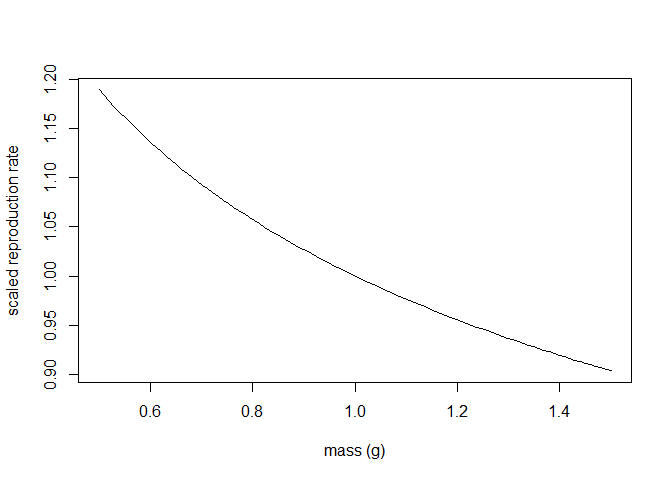
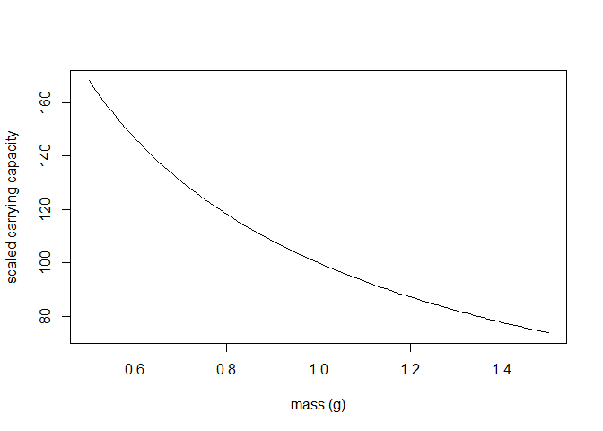
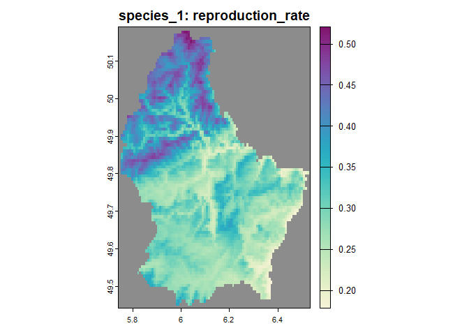
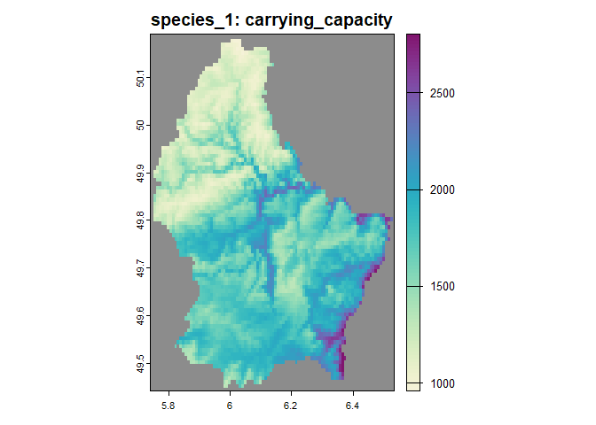

The metabolic rate of an organism is strongly dependent its size
(i.e. its mass) and on its body temperature (i.e. the temperature of the
environment for poikilotherm animals). In consequence this also
influences different processes such as growth, reproduction and
mortality. This concept is described in the “metabolic theory of
ecology” (MTE) by Brown et al. (2004) \[Ref: 1\] which can be expressed
in the following equation:
$${Y = Y_0 M^{a} e^{\frac{E}{k_B T}}}$$
Where:

-   *Y* = scaled parameter.
-   *Y*<sub>0</sub> = normalization constant.
-   *a* = allometric scaling exponent of the mass.
-   *M* = mean (individual) mass.
-   *T* = temperature in kelvin (K).
-   *E* = activation energy in electronvolts (eV).
-   *k*<sub>*B*</sub> = Boltzmann’s constant (eV / K).

To include this effect in simulations, `metaRange` offers the option to
use metabolic scaling based on the MTE through the function
`metabolic_scaling()`, which can be used to calculate the parameter
value for any metabolically influenced process. It has to be noted that
different processes have different activation energy values and scaling
exponents.

| Parameter               | Scaling exponent | Activation energy |
|:------------------------|:----------------:|------------------:|
| resource usage          |       3/4        |             -0.65 |
| reproduction, mortality |       -1/4       |             -0.65 |
| carrying capacity       |       -3/4       |              0.65 |

Table 1: Common parameter and their associated scaling exponents and
activation energies. Source: table 2 in Brown, J.H., Sibly, R.M. and
Kodric-Brown, A. (2012) \[Ref: 2\]

## Calculating the normalization constant

Since the data for experimentally measured values of the normalization
constant for different species is generally scarce, `metaRange` offers
the function `calculate_normalization_constant()` to calculate the
normalization constant based on an estimated value for the parameter
under a reference temperature.

Lets say for example we estimate that a species (avg. bodyweigth = 1
gram) has a reproduction rate of 1 and a carrying capacity of 100 at a
temperature of 20 degree Celcius (293.15 degree Kelvin). We can
calculate the normalization constant as follows:

``` r
library(metaRange)
R0 <- calculate_normalization_constant(
    parameter_value = 1,
    scaling_exponent = -1/4,
    mass = 1,
    reference_temperature = 293.15,
    E = -0.65
    # paramter "k" is given as default of the function
)
C0 <- calculate_normalization_constant(
    parameter_value = 100,
    scaling_exponent = -3/4,
    mass = 1,
    reference_temperature = 293.15,
    E = 0.65
    # paramter "k" is given as default of the function
)
```

Now we can use this constant to perform the metabolic scaling. Instead
of the reference temperature, we can now give a vector of different
temperatures (or possibly body weights), for which we want to calculate
the scaling. The MTE makes the following predictions about how the
different parameters scale in relation to mass and temperature:

-   Reproduction rate increases with temperature, but decreases with
    mass.
-   Carrying capacity decreases with temperature and with mass.

We can test these predictions by plotting the result of our example.

``` r
test_temperature <- seq(280, 300, length.out = 100)
control_temperature <- rep(293.15, 100)
test_mass <- seq(0.5, 1.5, length.out = 100)
control_mass <- rep(1, 100)

scaled_reproduction_rate <- metabolic_scaling(
    normalization_constant = R0,
    scaling_exponent = -1/4,
    mass = control_mass,
    temperature = test_temperature,
    E = -0.65
)
plot(
    test_temperature,
    scaled_reproduction_rate,
    type = "l",
    xlab = "temperature (K)",
    ylab = "scaled reproduction rate"
)
```


``` r
scaled_reproduction_rate <- metabolic_scaling(
    normalization_constant = R0,
    scaling_exponent = -1/4,
    mass = test_mass,
    temperature = control_temperature,
    E = -0.65
)
plot(
    test_mass,
    scaled_reproduction_rate,
    type = "l",
    xlab = "mass (g)",
    ylab = "scaled reproduction rate"
)
```



``` r
scaled_carrying_capacity_rate <- metabolic_scaling(
    normalization_constant = C0,
    scaling_exponent = -3/4,
    mass = control_mass,
    temperature = test_temperature,
    E = 0.65
)
plot(
    test_temperature,
    scaled_carrying_capacity_rate,
    type = "l",
    xlab = "temperature (K)",
    ylab = "scaled carrying capacity"
)
```


``` r
scaled_carrying_capacity_rate <- metabolic_scaling(
    normalization_constant = C0,
    scaling_exponent = -3/4,
    mass = test_mass,
    temperature = control_temperature,
    E = 0.65
)
plot(
    test_mass,
    scaled_carrying_capacity_rate,
    type = "l",
    xlab = "mass (g)",
    ylab = "scaled carrying capacity"
)
```



## Example

Now, to do include this in our simulation, we can set it up similarly as
in the previous vignettes.

``` r
library(terra)
set_verbosity(0)

raster_file <- system.file("ex/elev.tif", package = "terra")
r <- rast(raster_file)
temperature <- scale(r, center = FALSE, scale = TRUE) * 10 + 273.15
precipitation <- r * 2
temperature <- rep(temperature, 10)
precipitation <- rep(precipitation, 10)
landscape <- sds(temperature, precipitation)
names(landscape) <- c("temperature", "precipitation")

sim <- create_simulation(landscape)
sim$add_species(name = "species_1")
```

First, we define some basic traits.

``` r
sim$add_traits(
    species = "species_1",
    population_level = FALSE,
    temperature_maximum = 300,
    temperature_optimum = 288,
    temperature_minimum = 280
)
```

Then add the parameter used in the metabolic scaling as global
variables, since they are not specific to one species.

``` r
sim$add_globals(
    "E_reproduction_rate" = -0.65,
    "E_carrying_capacity" = 0.65,
    "exponent_reproduction_rate" = -1 / 4,
    "exponent_carrying_capacity" = -3 / 4,
    "k" = 8.617333e-05
)
```

We add the traits that are used in the reproduction model including an
estimate of the reproduction rate and the carrying capacity.

``` r
sim$add_traits(
    species = "species_1",
    population_level = TRUE,
    "abundance" = 100,
    "reproduction_rate" = 0.5,
    "carrying_capacity" = 1000,
    "mass" = 1
)
```

Now we can calculate the normalization constant, based on the parameter
estimate and the optimal temperature of the species and add them as
traits as well. Note that this could also be done in a loop over
multiple species.

``` r
sim$add_traits(
    species = "species_1",
    population_level = FALSE,
    "reproduction_rate_mte_constant" = calculate_normalization_constant(
        parameter_value = sim$species_1$traits[["reproduction_rate"]][[1]],
        scaling_exponent = sim$globals[["exponent_reproduction_rate"]],
        mass = sim$species_1$traits[["mass"]][[1]],
        reference_temperature = sim$species_1$traits[["temperature_optimum"]],
        E = sim$globals[["E_reproduction_rate"]],
        k = sim$globals[["k"]]
    ),
    "carrying_capacity_mte_constant" = calculate_normalization_constant(
        parameter_value = sim$species_1$traits[["carrying_capacity"]][[1]],
        scaling_exponent = sim$globals[["exponent_carrying_capacity"]],
        mass = sim$species_1$traits[["mass"]][[1]],
        reference_temperature = sim$species_1$traits[["temperature_optimum"]],
        E = sim$globals[["E_carrying_capacity"]],
        k = sim$globals[["k"]]
    )
)
```

Add finally, we can add a process that does the metabolic scaling in
each time step.

``` r
sim$add_process(
    species = "species_1",
    process_name = "mte",
    process_fun = function() {
        self$traits[["reproduction_rate"]] <- metabolic_scaling(
            normalization_constant = self$traits[["reproduction_rate_mte_constant"]],
            scaling_exponent = self$sim$globals[["exponent_reproduction_rate"]],
            mass = self$traits[["mass"]],
            temperature = self$sim$environment$current[["temperature"]],
            E = self$sim$globals[["E_reproduction_rate"]],
            k = self$sim$globals[["k"]]
        )

        self$traits[["carrying_capacity"]] <- metabolic_scaling(
            normalization_constant = self$traits[["carrying_capacity_mte_constant"]],
            scaling_exponent = self$sim$globals[["exponent_carrying_capacity"]],
            mass = self$traits[["mass"]],
            temperature = self$sim$environment$current[["temperature"]],
            E = self$sim$globals[["E_carrying_capacity"]],
            k = self$sim$globals[["k"]]
        )
    },
    execution_priority = 2
)
```

After this point, more processes could be added that use the scaled
parameters (See previous articles / vignettes). Here we just plot the
scaled parameter instead.

``` r
sim$set_time_layer_mapping(c(1, 2))
sim$begin()
plot_cols <- hcl.colors(100, "Purple-Yellow", rev = TRUE)
plot(sim, "species_1", "reproduction_rate", col = plot_cols, main = "Reproduction rate")
plot(sim, "species_1", "carrying_capacity", col = plot_cols, main = "Carrying capacity")
```



Note that these results show an “everything else equal” scenario, where
the only variable is the temperature. In a more realistic scenario, the
suitability of the habitat might also influence the reproduction rate
and carrying capacity or the mean individual body mass might change with
the temperature and change the results.

## References

1.  Brown, J.H., Gillooly, J.F., Allen, A.P., Savage, V.M. and West,
    G.B. (2004). Toward a Metabolic Theory of Ecology. *Ecology*,
    **85**: 1771-1789. <doi:10.1890/03-9000>

2.  Brown, J.H., Sibly, R.M. and Kodric-Brown, A. (2012). Introduction:
    Metabolism as the Basis for a Theoretical Unification of Ecology.
    In: *Metabolic Ecology* (eds R.M. Sibly, J.H. Brown and A.
    Kodric-Brown). <doi:10.1002/9781119968535.ch>
