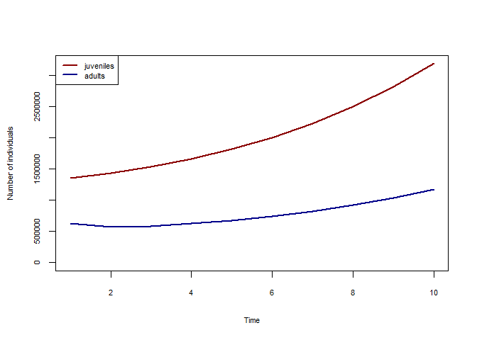

Many species have population dynamics that require more complex
equations than the simple Ricker model (which describes overcompensatory
scramble competition with non-overlapping generations). A common
abstraction to deal with this complexity is to partition a species into
functional subgroups that undergo different processes. This could for
example be *juveniles* who are dispersing and looking for a habitat, who
then become *adults* who are stationary but have the ability to
reproduce and generate the next generation of *juveniles*. The following
illustrates a simple example on how one could model such a system with
metaRange.

## Basic setup

``` r
library(metaRange)
library(terra)
```

Setup the basic simulation.

``` r
raster_file <- system.file("ex/elev.tif", package = "terra")
r <- rast(raster_file)
habitat <- scale(r, center = FALSE, scale = TRUE)
habitat <- rep(habitat, 10)
landscape <- sds(habitat)
names(landscape) <- "habitat"
sim <- create_simulation(landscape)
sim$add_species("species_1")
```

## Traits

Now we add the traits for both the *juveniles* and the *adults*.

``` r
sim$add_traits(
    species = "species_1",
    n_juveniles = 100,
    n_adults = 100,
    mortality_juveniles = 0.1,
    mortality_adults = 0.7,
    reproduction_rate = 2
)
sim$add_traits(
    species = "species_1",
    population_level = FALSE,
    dispersal_kernel = calculate_dispersal_kernel(
        max_dispersal_dist = 8,
        kfun = negative_exponential_function,
        mean_dispersal_dist = 4
    )
)
```

## Processes

The important part of this age structured population model is the
transition between the age classes. These processes could of course be
of any desired complexity, but to make the example easier to follow,
here we will just use simple functions:

``` r
sim$add_process(
    species = "species_1",
    process_name = "reproduction",
    process_fun = function() {
        self$traits[["n_juveniles"]] <-
            self$traits[["n_adults"]] + (
                self$traits[["n_adults"]] * self$traits[["reproduction_rate"]]
            ) * self$sim$environment$current$habitat
    },
    execution_priority = 1
)
sim$add_process(
    species = "species_1",
    process_name = "maturation",
    process_fun = function() {
        self$traits[["n_adults"]] <-
            self$traits[["n_adults"]] +
            self$traits[["n_juveniles"]] * (1 - self$traits[["mortality_juveniles"]])
    },
    execution_priority = 3
)
```

## More processes

As mentioned in the introduction paragraph, we will add a dispersal
process for the juveniles and an aditional process controlling the
mortality of the adults. Note that we do not need to add an
`mortality_of_juveniles` process, since their mortality is already
included in the `maturation` process.

``` r
sim$add_process(
    species = "species_1",
    process_name = "dispersal_of_juveniles",
    process_fun = function() {
        self$traits[["n_juveniles"]] <- dispersal(
            abundance = self$traits[["n_juveniles"]],
            dispersal_kernel = self$traits[["dispersal_kernel"]]
        )
    },
    execution_priority = 2
)
sim$add_process(
    species = "species_1",
    process_name = "mortality_of_adults",
    process_fun = function() {
        self$traits[["n_adults"]] <-
            self$traits[["n_adults"]] * (1 - self$traits[["mortality_adults"]])
    },
    execution_priority = 4
)
```

## Result

Lastly, we add a process that reports the numbers of adults and
juveniles over time, after which we can execute the simulation and plot
the results.

``` r
sim$add_globals(n_juveniles = c(), n_adults = c())
sim$add_process(
    process_name = "logger",
    process_fun = function() {
        self$globals$n_juveniles <-
            c(self$globals$n_juveniles, sum(self$species_1$traits[["n_juveniles"]]))
        self$globals$n_adults <-
            c(self$globals$n_adults, sum(self$species_1$traits[["n_adults"]]))
    },
    execution_priority = 5
)
sim$begin()
plot(
    1:10,
    sim$globals$n_juveniles,
    col = "darkred",
    type = "l",
    lwd = 2,
    ylim = c(0, max(sim$globals$n_juveniles, sim$globals$n_adults)),
    xlab = "Time",
    ylab = "Number of individuals",
    cex.lab = 0.7,
    cex.axis = 0.7
)
lines(1:10, sim$globals$n_adults, col = "darkblue", lwd = 2)
legend(
    "topleft",
    legend = c("juveniles", "adults"),
    col = c("darkred", "darkblue"),
    lty = 1,
    lwd = 2,
    cex = 0.7
)
```


